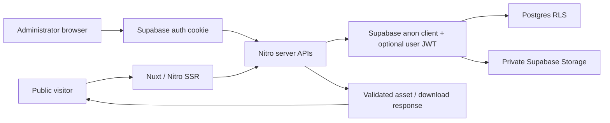
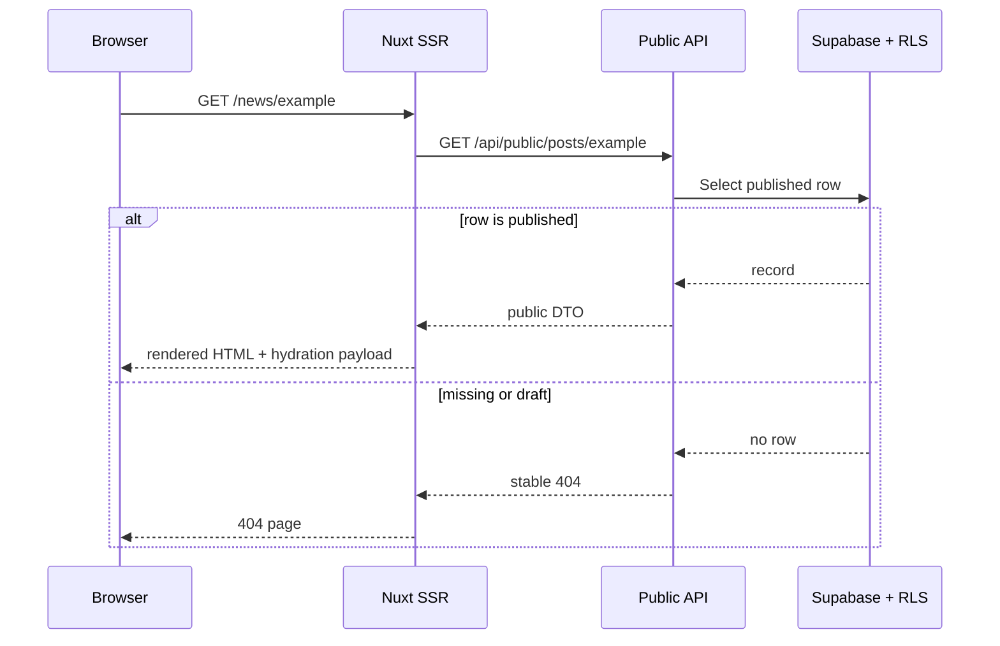
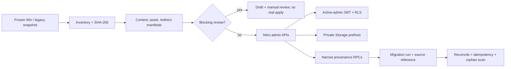

# Architecture

## Runtime shape

March Out For Love is a Nuxt 3 application rendered by Nitro. Public pages use SSR data fetched from same-origin server APIs. Administrator pages also call server APIs; browser code does not own database mutation authority.

## Authentication and authorization

Supabase Auth establishes a cookie-backed session. `useAdminAuth` loads `/api/admin/session`; the server-side `requireAdmin` helper resolves the user and requires an active `admin_users` row. Route middleware improves navigation behavior, but it is not the authorization boundary.

An authenticated user without an active administrator row receives `403`. Deactivated administrators therefore lose API access on the next request even when their Auth session remains valid. Phase 7 invitation and audit APIs use narrow database functions and preserve last-active-admin protection.

Mutating APIs additionally use same-origin validation. Postgres RLS independently evaluates the signed-in user's JWT with the fixed-search-path `is_admin()` function, which requires an active `admin_users` row. There is no service-role key and no Auth Admin API in the Nuxt runtime.

## Server API contract

Formal content reads and writes flow through `server/api`. Phase 8 modules are posts, files, FAQ, year summaries, and singleton site settings. Shared server utilities provide:

- mode selection with strict complete/absent environment semantics;
- active administrator client creation;
- UUID, slug, field, HTTPS URL, MIME, size, and filename validation;
- stable HTTP status/code mapping without raw provider errors;
- database row-to-public/admin response mapping;
- private Storage path generation and cleanup compensation.

Create/update responses return the mapped record. Collection responses use `{ items }`; singleton settings return `{ settings }`. Expected errors use stable status codes such as `400`, `401`, `403`, `404`, `409`, `413`, `415`, and `503`.

## Public SSR data flow

Public APIs select only rows admitted by public RLS policies. They never accept a caller-provided Storage path. Post/year cover and file-download endpoints first resolve an eligible published database row, create a short-lived signed URL on the server, fetch the object, and return controlled headers. Public download filenames are normalized for safe `Content-Disposition`.

No database-authored content is rendered with `v-html`. Paragraph formatting is preserved with CSS whitespace behavior, keeping output text-safe.

## Content and Storage model

| Module | Table | Public condition | Private object location |
| --- | --- | --- | --- |
| Posts | `posts` | `status = 'published'` | `content-assets/posts/{id}/...` |
| Files | `files` | `status = 'published'` and object metadata complete | `downloads/files/{id}/...` |
| FAQ | `faq` | `is_active = true` | none |
| Year summaries | `year_summaries` | `status = 'published'` | `content-assets/years/{id}/...` |
| Settings | `site_settings` | singleton row | none in Phase 8 |

`content-assets` and `downloads` are private. Storage policies permit active administrators to manage only expected prefixes. Published-object select policies are relation-scoped so the server's anon client can create a signed URL; they are not blanket public bucket policies. The browser never receives a permanent object URL or raw storage path in a public DTO.

Delete and replace flows remove new uploads when database persistence fails, and remove displaced objects after successful metadata replacement. Database row deletion and object cleanup are both exercised by smoke tests.

## RLS and database invariants

Every Phase 8 content table has RLS enabled. Anonymous access is limited to published/active reads. Active administrators receive separate select/insert/update/delete policies rather than a broad authenticated or `FOR ALL` policy.

Database invariants include:

- unique post slug;
- complete status and publication checks;
- nonnegative file sizes and sort orders;
- unique academic year;
- JSON array/object shape checks for year highlights/statistics;
- one `site_settings` row through a singleton boolean and unique index;
- fixed categories through read-only grants/policies;
- atomic FAQ reorder through a validated database function.

Phase 8 clears `published_at` on unpublish and assigns the current timestamp on every publish. This is consistent across posts, files, and year summaries.

Phase 9 moves publication timestamp assignment into a fixed-search-path database trigger for activities, posts, files, and year summaries. Public RLS compares against the database clock, so using that same clock prevents a successful publish from briefly returning `404` when the application host clock is ahead by a few milliseconds. The trigger does not add grants or bypass RLS.

## Mock and Supabase modes

`getContentDataMode` selects behavior:

- both `NUXT_PUBLIC_SUPABASE_URL` and `NUXT_PUBLIC_SUPABASE_ANON_KEY` present: Supabase mode;
- both absent: public mock mode;
- only one present: stable `503` configuration error.

Supabase errors do not cause a mock fallback. Administrator APIs are unavailable in mock mode. This prevents an outage or configuration mistake from silently presenting non-production content as authoritative.

## Migration source of truth

Ordered files in `supabase/migrations` are canonical. `supabase/schema.sql` is intentionally deprecated and non-executable because the historic snapshot contained unsafe policies and public bucket assumptions. A fresh environment applies all migrations in filename order, followed by the read-only verification scripts in `supabase/README.md`.

The Phase 8 migration evolves existing rows in place. It retains legacy URL columns as nullable compatibility data for a later controlled migration; formal Phase 8 APIs use only private Storage metadata. SQL Editor execution history is external state, so the repository records the exact migration and a repeatable invariant verification file.

## Phase 9 migration boundary

`content_migration_runs` records an immutable run key, source snapshot hash, mode, lifecycle status, and aggregate evidence. `content_source_refs` maps a source-system/kind/key tuple to one target natural key and row. Both tables have RLS enabled and no direct browser table grants. Active administrators may call only the fixed-search-path Phase 9 RPCs; formal target writes and Storage uploads continue through same-origin Nitro APIs using the signed-in user's JWT.

The pipeline fails closed for publication when an authoritative field is missing. Items remain draft, retain their source/hash and decision basis, and enter `manual-review.csv`; the migrator never invents dates, years, categories, participant counts, attachments, paths, or publish state. An explicit `participantsCount: null` preserves unknown source values while ordinary administrator-created drafts retain the existing API defaults. Source snapshots and manifests contain no credentials or signed URLs. The official Wix site was frozen at snapshot `3a6a00b…ceb60`; real apply created only private drafts, and the separate synthetic path proves retry, resume, second-apply idempotency, verification, and rollback.
